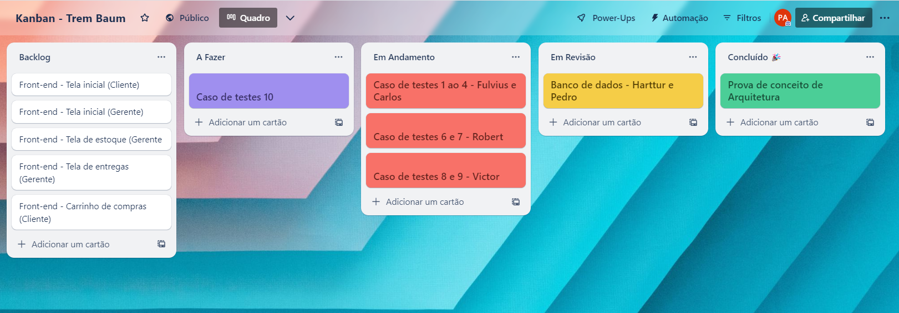

# Metodologia

A metodologia contempla as definições das ferramentas utilizadas pela equipe tanto para a manutenção dos códigos e dos demais artefatos quanto para a organização do time na execução das tarefas do projeto.

## Controle de Versão

A ferramenta de controle de versão adotada no projeto foi o
[Git](https://git-scm.com/), sendo que o [Github](https://github.com)
foi utilizado para hospedagem do repositório.

O projeto segue a seguinte convenção para o nome de branches:

- `main`: versão estável já testada do software

Quanto à gerência de issues, o projeto adota a seguinte convenção para
etiquetas:

- **`documentation:`** melhorias ou acréscimos à documentação
- **`bug:`** uma funcionalidade encontra-se com problemas
- **`enhancement:`** uma funcionalidade precisa ser melhorada
- **`feature:`** uma nova funcionalidade precisa ser introduzida

## Gerenciamento de Projeto

### Divisão de Papéis

A equipe utiliza metodologias ágeis, tendo escolhido o Scrum como base para definição do processo de desenvolvimento.

A equipe está organizada da seguinte maneira:

- **Scrum Master:** Robert
- **Product Owner:** Robert
- **Equipe de Desenvolvimento:** Pedro, Victor Beltrão, Robert, Hartur, Carlos, Fulvius
- **Equipe de Design:** Pedro, Victor Beltrão, Robert, Hartur, Carlos, Fulvius

### Processo

Para melhor organização está sendo utilizado o Trello com as seguintes listas:

- **Backlog:** Todos os artefatos da solução que serão quebrados em tarefas etapas.
- **A Fazer:** Tarefas da etapa em desenvolvimento que precisam ser feitas e ainda não foram atribuídas a nenhum membro.
- **Em Andamento:** Todas as tarefas da etapa que estão sendo feitas por algum dos membros.
- **Em Revisão:** Tarefa que está sendo revisada por outro membro.
- **Concluído:** Todas as tarefas que foram concluídas.

### Ferramentas

As ferramentas empregadas no projeto são:

- **Visual Studio Code** 
- **Discord**
- **Figma**

Todas as ferramentas foram escolhidas visando a facilidade de uso e familiaridade da equipe, permitindo que ocorra um melhor trabalho em grupo.
