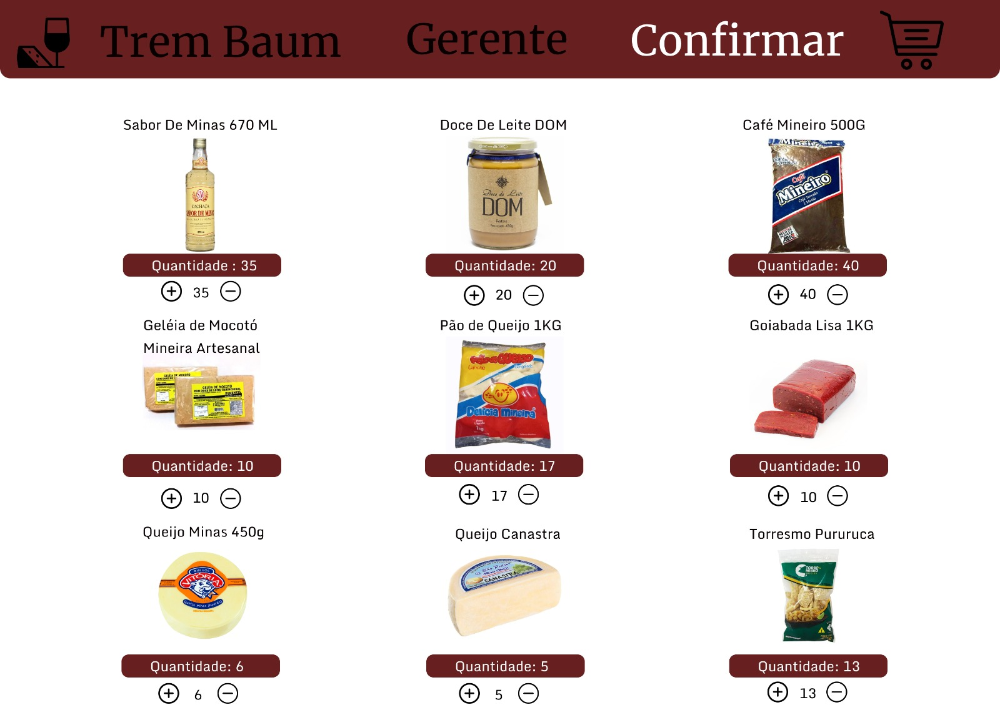

# Projeto de Interface

Pré-requisitos: <a href="2-Especificação do Projeto.md"> Documentação de Especificação</a>

Visão geral da interação do usuário pelas telas do sistema e protótipo interativo das telas com as funcionalidades que fazem parte do sistema (wireframes).

 Apresente as principais interfaces da plataforma. Discuta como ela foi elaborada de forma a atender os requisitos funcionais, não funcionais e histórias de usuário abordados nas <a href="2-Especificação do Projeto.md"> Documentação de Especificação</a>.

## Diagrama de Fluxo

## Wireframes

A visualização interativa pode ser feita através do [Figma](https://www.figma.com/proto/OaU4wDe4LdbyP85X4XFRa5/Trem-Baum?type=design&node-id=9-465&t=nshUQMUnZ5OiWmKl-1&scaling=contain&page-id=0%3A1&starting-point-node-id=9%3A465).

### Tela - Inicial

### Tela - Login

### Tela - Cadastro

### Tela - Inicial (Gerente)

### Tela - Entregas (Gerente)

### Tela - Estoque (Gerente)

### Tela - Inicial (Cliente)

### Tela - Carrinho de Compras

