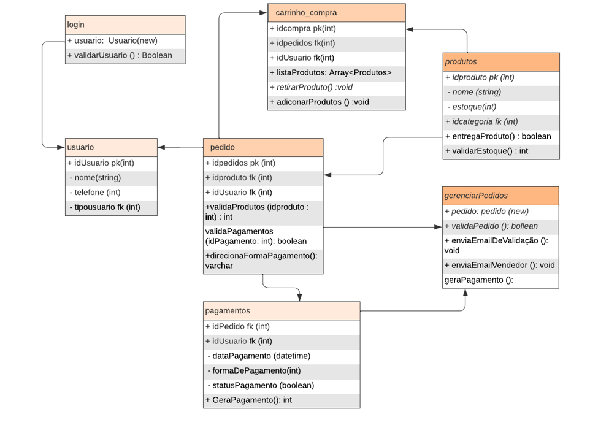

# Arquitetura da Solução

Pré-requisitos: <a href="3-Projeto de Interface.md"> Projeto de Interface</a>

Definição de como o software é estruturado em termos dos componentes que fazem parte da solução e do ambiente de hospedagem da aplicação.

## Diagrama de Classes

## Modelo ER (Projeto Conceitual)

O Modelo ER representa através de um diagrama como as entidades (coisas, objetos) se relacionam entre si na aplicação interativa.

.jpeg)

## Projeto da Base de Dados

O projeto da base de dados corresponde à representação das entidades e relacionamentos identificadas no Modelo ER, no formato de tabelas, com colunas e chaves primárias/estrangeiras necessárias para representar corretamente as restrições de integridade.

 
Para mais informações, consulte o microfundamento "Modelagem de Dados".

## Tecnologias Utilizadas

Visual Studio Code, C#, Lucidchart.

## Hospedagem

A hospedagem do site será feita através do Github Pages.
