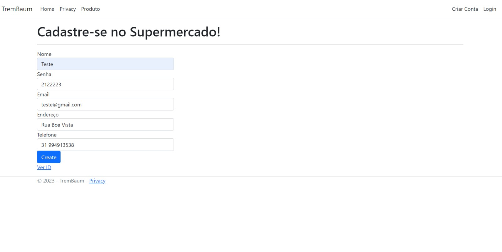

# Registro de Testes de Software

| **Caso de Teste** 	| **CT-01 – Cadastro de usuário** 	|
|:---:	|:---:	|
|	Requisito Associado 	| RF-01 -  O supermercado deve permitir o cadastro de clientes e gerentes. |
|  	|  	|

| **Caso de Teste** 	| **CT-02 - Cadastro de gerente**	|
|:---:	|:---:	|
|Requisito Associado | RF-01	- O supermercado deve permitir o cadastro de clientes e gerentes. |

|  	|  	|
| **Caso de Teste** 	| **CT-03 - Efetuar login do usuário (cliente)**	|
|Requisito Associado | RF-02	- O supermercado deve permitir o login de clientes e gerentes. |

|  	|  	|
| **Caso de Teste** 	| **CT-04 - Efetuar login do gerente**	|
|Requisito Associado | RF-02	- O supermercado deve permitir o login de clientes e gerentes. |

|  	|  	|
| **Caso de Teste** 	| **CT-05 - Apresentar lista de produtos**	|
|Requisito Associado | RF-03	- O supermercado deve apresentar uma lista com seus produtos. |

|  	|  	|
| **Caso de Teste** 	| **CT-06 - Realização de pedidos** |
|Requisito Associado | RF-04	- O supermercado deve permitir que clientes realizem pedidos. |

|  	|  	|

| **Caso de Teste** 	| **CT-07 - Verificação e atualização do estoque**	|
|:---:	|:---:	|
|Requisito Associado | RF-06	- O supermercado deve permitir que gerentes verifiquem e atualizem o estoque. |

|  	|  	|
